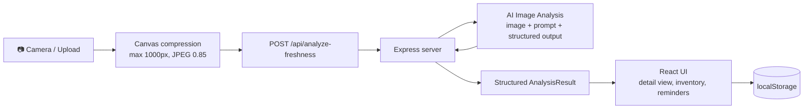

<div align="center">

# 🥑 FreshSense AI

### Point your camera at a fruit or vegetable. Know how fresh it is, how long it will last, and when to eat it.

AI-powered produce freshness detection and shelf-life tracking, built with **React 19** and **TypeScript**.


<!-- Add a screenshot or GIF here. It is the single biggest boost for a recruiter skimming this page. -->

<!--  -->

</div>

---

## Why this exists

Roughly a third of the food produced worldwide is wasted, and a large share of that happens in home kitchens because people can't tell when produce is about to turn. Best-before dates don't help with loose fruit and vegetables.

FreshSense AI turns a phone or webcam photo into an actionable freshness report: what the item is, how fresh it is right now, how many days it has left, how to store it, and what to cook with it before it's too late. It then reminds you before it spoils.

## Features

|     | Feature                         | What it does                                                                                      |
| --- | ------------------------------- | ------------------------------------------------------------------------------------------------- |
| 📸  | **Scan by camera or upload**    | Live webcam/mobile capture (front or rear camera) or drag-and-drop image upload                   |
| 🧠  | **AI analysis**                 | AI identifies the item and scores freshness from 0 to 100 with a status label                     |
| ⏳   | **Shelf-life estimate**         | Predicted days remaining plus a human-friendly range such as "4-6 days"                           |
| 🔍  | **Visual observations**         | Lists the specific defects or markers the model saw (bruising, spots, skin texture)               |
| 🧴  | **Wax / coating detection**     | Estimates the probability of artificial wax or colour enhancement, with the visual cues behind it |
| 🕳️ | **Hidden-rot risk**             | Low / medium / high internal-decay risk, with an honest note that cameras only see the surface    |
| 🤏  | **Squeeze-test calibration**    | You report firm, soft, or mushy and the freshness score and shelf life adjust accordingly         |
| 🔔  | **Expiry reminders**            | Browser notifications and in-app alerts a configurable number of days before estimated spoilage   |
| 🥗  | **Storage and culinary advice** | Ideal storage environment, spoilage signs to watch for, and what to cook at the current ripeness  |
| 🗂️ | **Inventory dashboard**         | Searchable, filterable catalog of scanned items, persisted across sessions                        |

## How it works



1. **Capture and compress.** The browser resizes the image on a canvas before upload, which keeps requests small and analysis fast.

2. **Analyze server-side.** The Express backend processes the image using the AI analysis service. The API credentials never reach the client.

3. **Structured output, not free text.** The request uses structured output with defined fields, so the response maps directly onto a TypeScript interface, with no fragile string parsing.

4. **Track and remind.** Results are saved to the inventory, an expiry date is computed from the shelf-life estimate, and a reminder is scheduled by default.

## Engineering highlights

* **Schema-constrained AI output.** The response schema (`server.ts`) and the `AnalysisResult` type (`src/types.ts`) describe the same contract, which makes the AI output type-safe end to end.

* **Secure API-key handling.** API credentials are only ever used on the server; the browser talks to a thin `/api/analyze-freshness` proxy.

* **Single-process dev and prod.** Express mounts Vite as middleware in development and serves the built `dist/` in production, so there is one server, one port, and no CORS setup.

* **Client-side image optimization.** Canvas resizing and JPEG re-encoding cut payload size before it leaves the device.

* **Resilient UX.** A 30-second `AbortController` timeout prevents stuck spinners, and errors surface with actionable messages.

* **Honest AI.** The app explicitly tells users what a camera cannot see (internal rot) and gives them a manual squeeze test to correct the estimate, rather than presenting the model's output as certainty.

* **Time-travel testing.** A built-in "advance one day" simulator lets you verify the reminder and expiry logic without waiting for real days to pass.

## Tech stack

| Layer        | Technology                                                                      |
| ------------ | ------------------------------------------------------------------------------- |
| Frontend     | React 19, TypeScript, Vite 6, Tailwind CSS 4, Motion (animations), Lucide icons |
| Backend      | Node.js, Express 4, `tsx` for dev                                               |
| AI           | Multimodal AI analysis with structured JSON output                              |
| Browser APIs | `getUserMedia` (camera), Canvas, Notifications API, `localStorage`              |
| Build        | Vite for the client, esbuild bundling the server to `dist/server.cjs`           |

## Getting started

### Prerequisites

* Node.js 18 or newer

### Installation

```bash
# 1. Clone the repository
git clone https://github.com/<your-username>/freshsense-ai.git

cd freshsense-ai

# 2. Install dependencies
npm install

# 3. Configure your environment
cp .env.example .env

# then edit .env and set your AI API key

# 4. Start the dev server
npm run dev
```

Open **http://localhost:3000**.

### Environment variables

| Variable     | Required | Description                             |
| ------------ | -------- | --------------------------------------- |
| `AI_API_KEY` | ✅        | API key used by the AI analysis service |
| `APP_URL`    | ❌        | Public URL of the deployed app          |

### Scripts

| Command         | Description                                         |
| --------------- | --------------------------------------------------- |
| `npm run dev`   | Start the Express and Vite dev server on port 3000  |
| `npm run build` | Build the client and bundle the server into `dist/` |
| `npm start`     | Run the production build (`NODE_ENV=production`)    |
| `npm run lint`  | Type-check with `tsc --noEmit`                      |

## API

### `POST /api/analyze-freshness`

**Request**

```json
{
  "image": "data:image/jpeg;base64,/9j/4AAQ...",
  "mimeType": "image/jpeg"
}
```

**Response** (abridged)

```json
{
  "itemName": "Cavendish Banana",
  "isFresh": true,
  "freshnessStatus": "Slightly Bruised",
  "freshnessPercentage": 72,
  "shelfLifeEstimateDays": 3,
  "shelfLifeRange": "2-4 days",
  "visualObservations": [
    "Small brown spots near the stem",
    "Firm, even yellow skin"
  ],
  "storageRecommendation": "...",
  "spoilageSignals": [
    "Sour or alcoholic smell",
    "Skin feels soft and squishy"
  ],
  "artificialCoatingProbability": 12,
  "detectedInternalRotRisk": "low",
  "culinaryAdvice": "Ideal for banana bread or freezer smoothie bags."
}
```

## Project structure

```text
freshsense-ai/

├── server.ts                       # Express API, AI client, Vite middleware
├── index.html
├── vite.config.ts
└── src/

    ├── App.tsx                    # Inventory dashboard, reminders, state

    ├── types.ts                   # AnalysisResult, ScannedProduce, ExpiryReminder

    ├── components/

    │   ├── CameraUploader.tsx     # Webcam capture and drag-and-drop upload

    │   └── FreshnessDetailView.tsx # Full analysis report and squeeze-test UI

    └── utils/

        └── imageCompressor.ts     # Canvas-based resize and compression
```

## Limitations

* A photo shows only the surface. Internal rot, mold beneath the skin, and food-safety conditions can't be confirmed visually, and the app says so. **Treat results as guidance, not a food-safety guarantee.**

* Shelf-life figures are model estimates under standard household conditions.

* The inventory is stored in the browser's `localStorage`, so it is per-device.

## Roadmap

* [ ] Accounts and cloud sync across devices

* [ ] Scheduled push notifications through a service worker (works when the tab is closed)

* [ ] Batch scanning of multiple items in one photo

* [ ] Recipe suggestions based on what's about to expire

* [ ] Automated tests and CI for the analysis pipeline

* [ ] Docker image and one-click deploy

## Contributing

Issues and pull requests are welcome. For larger changes, please open an issue first to discuss what you'd like to change.

## License

Distributed under the MIT License. See `LICENSE` for details.

## Author

**Abhay Sharma**

[LinkedIn](https://linkedin.com/in/your-handle) · [Portfolio](https://your-site.com) · [GitHub](https://github.com/Abhay-07082005)

---

<div align="center">

If this project helped or interested you, consider giving it a ⭐

</div>
```
